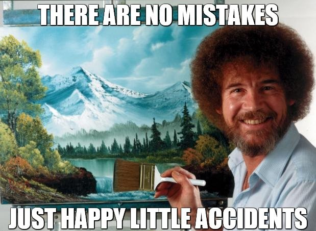

#  Chroma Ray Tracer 
## Accidental Art Page
### Author:Alper Şahıstan([STLKRv1](https://github.com/STLKRv1))  

[Development Blog](README.md)  

  
  
## What is this?

This page is dedicated for "artsy" looking render fails that are too damn special to discard.  

  
  
## Gallery

   
*"That rectangle has more dept than my master thesis"*  

  
*"Cornell box re-imagined as a **Middle-Eastern Carpet pattern**"*  

  
*Flower artifacts effect DLC for 9.99$*  

   
*Somebody call [Keanu Reeves his robot friend]( https://www.imdb.com/title/tt0970416/ ) is here*  

  
*I have succesfully implemented X-Ray tracing! What is next? ray-traced Mortal Kombat !?*  

