#  Chroma Ray Tracer 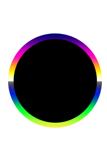
## Development Blog 
### Author:Alper Şahıstan([STLKRv1](https://github.com/STLKRv1)) 

 

## Introduction  
This repository is meant to contain a simple implementation of the ray tracing algorithm. Hopefully will surpass its humble conception. This page will also be used as a blog to update on the development process. Developed for CENG795 course at METU(2019-2020 Spring Semester).

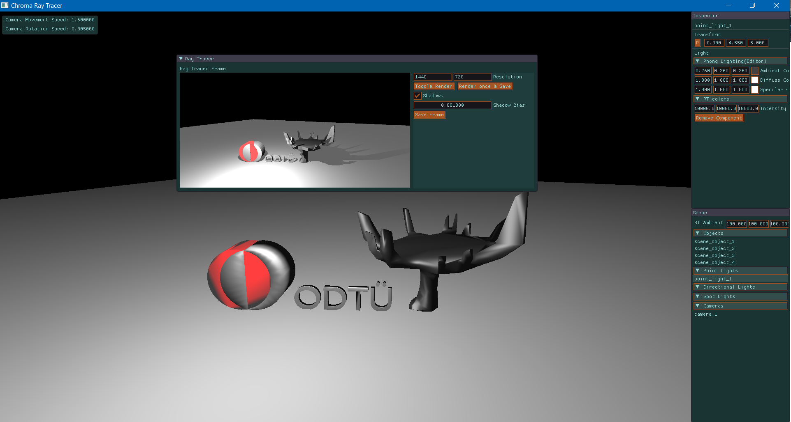
 

Here is a full preview of Chroma-Ray Tracer enviroment

## Build instructions for Windows  
### Requires:
* Visual Stuido(VS) 17+
* CMake 3.15.0+
### Instructions
After downloading and unzipping the repo open Cmake and fill the fields:  
**Where is the source:** unzipped/folders/directory/Chroma-RayTracer  
**Where to build binaries:** unzipped/folders/directory/Chroma-RayTracer/build  
then click configure where you will set your Visual studio version as the **"Generator for this project"*** and *x64* as **"Optional platform generator"**. Also select **"Use default native compilers"** option if it is not already selected.  
**Configure** then **Generate**.  
Then open the chroma-ray-tracer.sln file generated using VS located in the ./Chroma-RayTracer/build folder.  
Finally **Build** solution using VS.  

**Note:** After building the project, if it fails to run due to missing .exe file try setting the location of the .exe file by:  
Solution explorer -> chroma-ray-tracer -> (right click ->) properties -> General -> Output Directory -> 
* if Configuration: Debug -> unzipped/folders/directory/Chroma-RayTracer/bin/Debug  
* if Configuration: Release -> unzipped/folders/directory/Chroma-RayTracer/bin/Release

## Week 1
Although I have not made any advancements regarding "Ray-tracing" I have retrofitted my old classes from my old renderer[[1]](#1) to build a simple editor. This editor can;
* Load .obj files
* Render multiple lights of types:
  * Point lights
  * Directional lights
  * Spot lights
* Support textures
* Allow basic navigation/editing over the scene
* Uses Phong Shading  
Please keep in mind that footages given below are NOT ray traced in any shape or form. They are rendered using OpenGL3.  
Here is a video:  
<blockquote class="twitter-tweet">
Recently I started developing my RayTracer. Although I have not implemented any sort of RayTracer(yet).I retrofitted my old renderer classes and combined them with a custom ImGui UI to create a simple editor. Here is the result. I MAKE THE BUNNY DISAPPEAR in the end.MAGIC!?🎩🐇 <a href="https://t.co/SqCnVzLw9Z">pic.twitter.com/SqCnVzLw9Z</a>
&mdash; Alper Ş (@stlkr_v1) <a href="https://twitter.com/stlkr_v1/status/1225586675490971648?ref_src=twsrc%5Etfw">February 7, 2020</a></blockquote>  
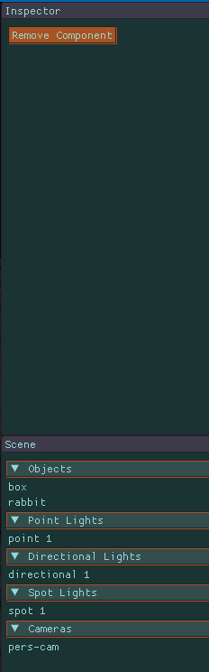      
**Figure 1:** Snapshot from Scene editor UI  &  Snapshot from Ray tracer window(since it uses GPU texture memory when left uninitialized it fetches some random texture).  
  

 

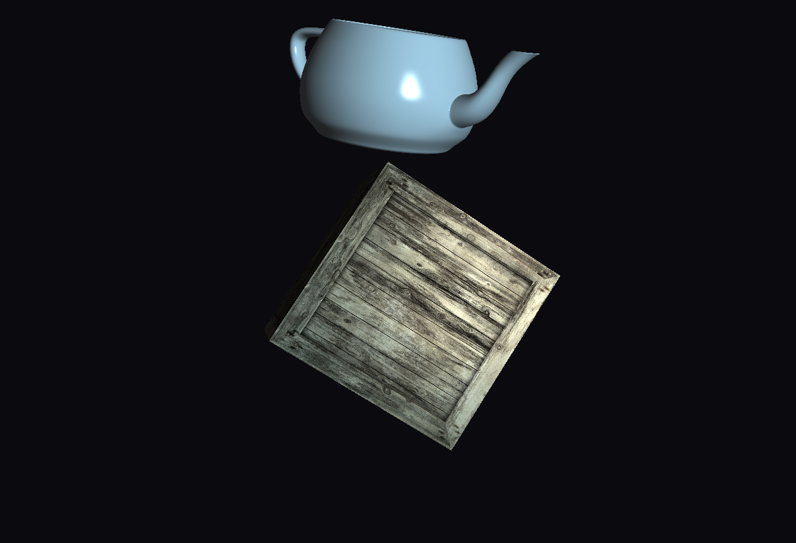  
**Figure 2:** Example render of a Utah teapot and a crate

## Week 2
Asset importer for the scene files has been completed. It simply parses the xml file to construct the scene specified by it. Figure 3 displays the scene called "<a href="assets/scenes/simple.xml">simple.xml</a>"(Provided by course instructor) as rendered in the Raster based rendering pipeline(NOT ray traced).

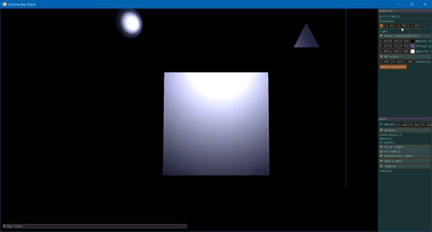  
**Figure 3:** Raster based render of the scene from editor.  

Finally, everything is set. I have started working on the Ray Tracer. Some attemps are made. Sphere-Ray intersection has been implemented and seems to be working. However rays are not allined properly. **Figure 4** includes a screenshot of the sphere in the scene. It should be noted that Ray Tracer currently just casts rays and paints the pixels if they hit an object. Nothing fancy yet.

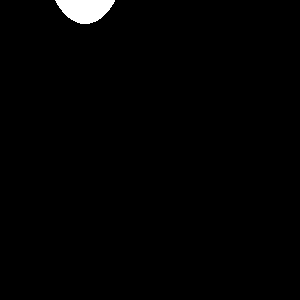  
**Figure 4:** 300x300 image of a ray traced sphere. Failed to properly set ray directions to the near plane. No lighting calculations are made. Just hit tests.   
  
After some fiddling with the code I have found the errors. One of the particular errors I have encountered was causing occluded objects to be rendered as if the objects that occlude them were "transparent"(see **Figure 5**). I quickly realised one must take the smallest t value when considering ray hits at ray direction t. After solving this problem, I was able to implement the ray tracer without shadows. **Figure 6** displays spheres scene without shadows. I have implemented Möller-Trumbore's method for ray-triangle intersections which is a efficient implementation of Cramer's rule[[2]](#2). The introductary article and the intersection methods on the scratch a pixel website was also utilized[[3]](#3). For the sphere intersection I implemented a simple "discriminant-based" method.  

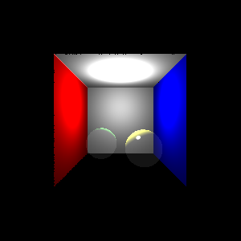  
**Figure 5:** Failed render of the Cornell box due to dept problem.   

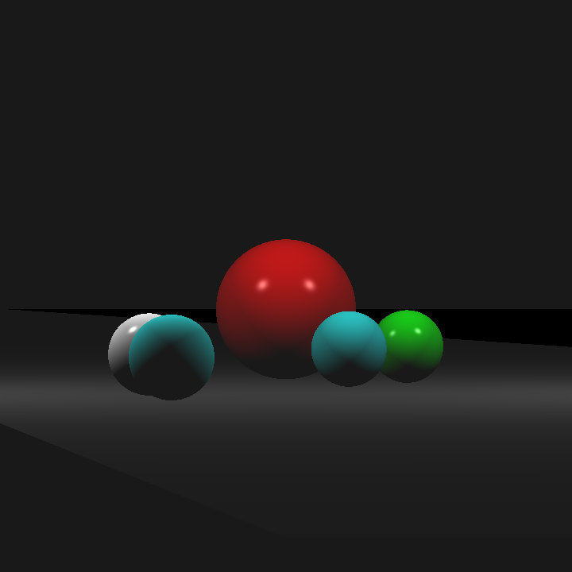  
**Figure 6:** Shadowless render of spheres scene. 

## Week 3  
To begin with shadows, I have implemented a loop that goes over all the scene objects to check if they occlude the light or not. I have used the same intersection methods in the **week 2** to check if the rays cast from intersection point to light position intersects with another scene object. However, this part deemed it self to be very challenging since there were small intricacies.  
First of those intricacies was tracking the t value in the ray equation. This was important because our shadow rays may reach to the light and keep going until they intersect an object behind the light where we mark this ray as shadowed although it is not. **Figure 7** illustrates this problem. And **Figure 7** displays the render failure due to this error.  
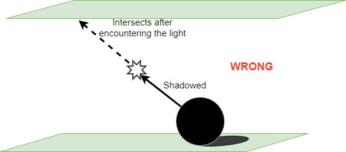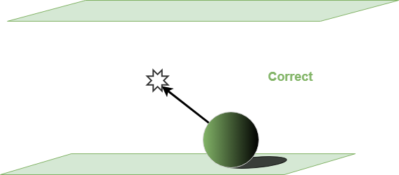  
**Figure 7:** On left object is shadowed due to extra intersection, on right correct calculation is shown.  

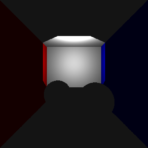  
**Figure 8:** Failed render of the Cornell box due to incorrect shadowing.  

Another problem I have encountered was the mistake in the Scratch a pixel's implementation of the Möller-Trumbore method. This implementation did not returned false when t in the ray equation is negative. So a ray that has an object behind it's origin returned true although it should not have. Of course this was not a problem for the camera rays since they did not encounter anythşng behind them yet this was causing problems when we triend to calculate shadow rays. Thats why this error went unnoticed until now(and possibly by the authors of the article [[3]](#3) ).  **Figure 9** Demonstrates the render failure due to this problem.
I have tweeted about the problem if one deems this subject interesting he can follow the link: https://twitter.com/stlkr_v1/status/1229527293351124992  
  
  
**Figure 9:** Render failure at the science tree scene due to negative t values for shadow rays.  

To conclude interms of HW1, here are my final renders of all the scenes provided:  
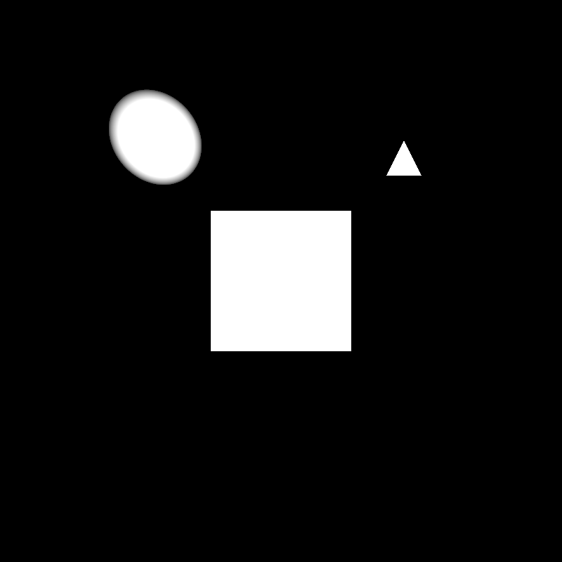 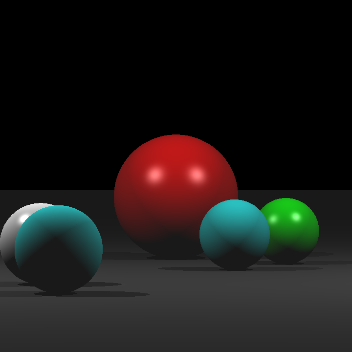   
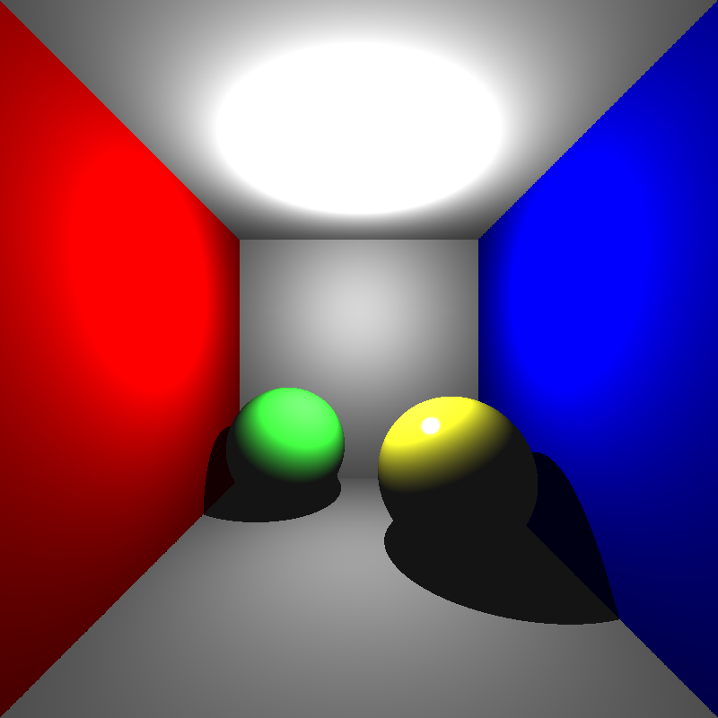 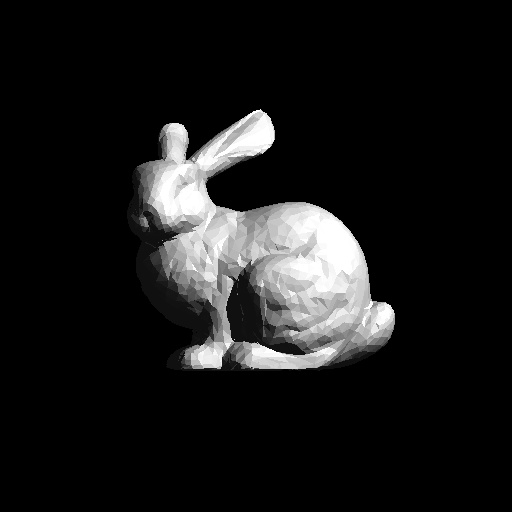  
**Figure 10:** Final renders for HW1. 
  
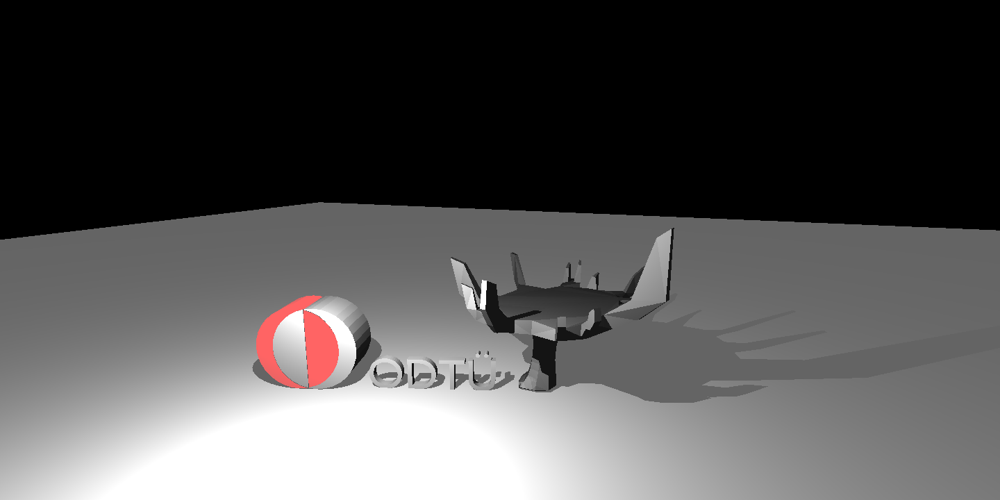  
**Figure 11:** Final render of the ODTU "science tree" and logo. ***This can be considered as treason among "Bilkenters".***  

## References
<a id="1">[1]</a>
Chroma-Works, “chroma-works/Chroma-Engine,” GitHub, 15-Aug-2019. [Online]. Available: https://github.com/chroma-works/Chroma-Engine. [Accessed: 07-Feb-2020].  
<a id="2">[2]</a>
T. Möller and B. Trumbore, “Fast, Minimum Storage Ray-Triangle Intersection,” Journal of Graphics Tools, vol. 2, no. 1, pp. 21–28, 1997.  
<a id="3">[3]</a>
Scratchapixel, Ray Tracing: Rendering a Triangle (Möller-Trumbore algorithm), 15-Aug-2014. [Online]. Available: https://www.scratchapixel.com/lessons/3d-basic-rendering/ray-tracing-rendering-a-triangle/moller-trumbore-ray-triangle-intersection. [Accessed: 18-Feb-2020].
